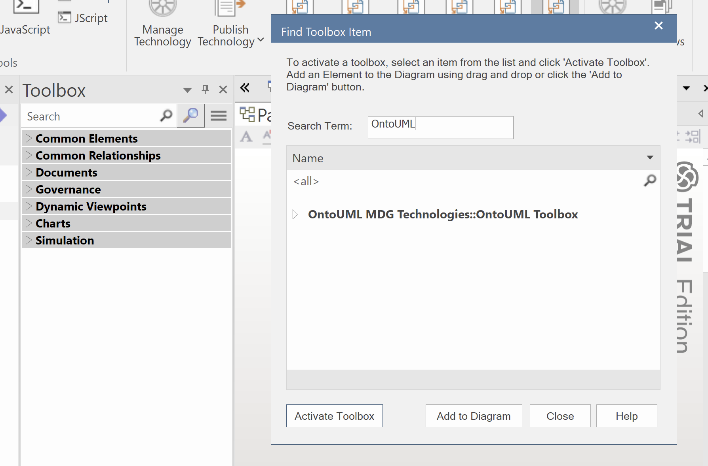

# OntoUML Plugin Enterprise Architect

This project contains an OntoUML plugin for Sparx Systems' [Enterprise Architect](https://sparxsystems.com/).

This project is defined under the umbrella of the [OntoUML Server](https://github.com/OntoUML/ontouml-server) project and is currently a proof of concept.

This is an open source project distributed under [Apache-2.0 license](./LICENSE.txt).

## Contents

- [OntoUML Plugin Enterprise Architect](#ontouml-plugin-enterprise-architect)
  - [Contents](#contents)
  - [User instructions](#user-instructions)
  - [Developer instructions](#developer-instructions)
  - [Reporting issues](#reporting-issues)

## User instructions

This repository contains two components: the OntoUML profile for Enterprise Architect and the OntoUML Plugin for Enterprise Architect.

The profile is developed as a [MDG Technology](https://sparxsystems.com/enterprise_architect_user_guide/16.1/modeling_frameworks/mdg_technologies.html) which includes different customizations to support the development of OntoUML models. Currently available features include:

- the complete set of OntoUML stereotypes with their associated tagged values
- basic coloring of classes decorated with OntoUML stereotypes
- custom toolbox for quick access to OntoUML elements and relevant UML elements

To install the OntoUML profile you can download the file [`./mdg-technology-files/ontouml-mdg.xml`](./mdg-technology-files/ontouml-mdg.xml) and use the wizard at *Specialize > Technologies > Publish Technology > Import MDG Technology* (detailed instructions available [here](https://sparxsystems.com/enterprise_architect_user_guide/16.1/modeling_frameworks/importmdgtechnologies.html)).

**If you have multiple installations of OntoUML profiles, please go to *Specialize > MDG Technologies* and disable them to avoid conflicts.**

Once installed, all OntoUML stereotypes will be readily available. To use the OntoUML toolbox in your diagram, however, click in the *magnifier icon* at the of your current toolbox and search for the term "OntoUML".

## Developer instructions

To develop the OntoUML profile, you can open and modify the EA project `./mdg-technology-files/ontouml-profile.qea`. Each package decorated with a `«profile»` stereotype in the *Browse* pane contains a different component of the whole MDG technology file, such as the profile (i.e., the OntoUML language) and the toolbar. 

For deploying your changes, each profile package must be exported independently as a *UML profile* (details [here]((https://sparxsystems.com/enterprise_architect_user_guide/16.1/modeling_frameworks/exportprofile_2.html))). Afterwards, you must package all exported files into a single *MDG technology file* following the tailored wizard (details [here](https://sparxsystems.com/enterprise_architect_user_guide/16.1/modeling_frameworks/creatingmdgtechnologies.html)).

## Reporting issues

Issues and questions can be submitted through the repository's [issues page](https://github.com/OntoUML/ontouml-ea-plugin/issues).
